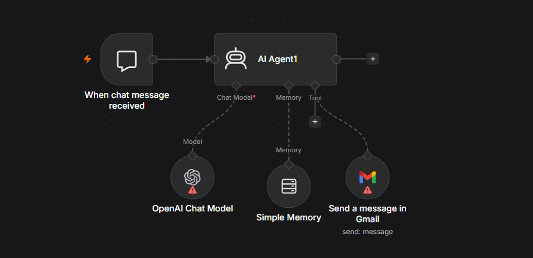

# 📧 AI Email Assistant

An AI-powered email automation workflow built with **n8n**, **OpenAI GPT-5 Mini**, and **Gmail**. The workflow accepts natural language requests, generates professional emails using AI, and sends them directly through Gmail.

---

## ✨ Features

- 🤖 Generates professional emails using AI
- 💬 Accepts natural language instructions through the n8n Chat Trigger
- 📧 Sends emails automatically using Gmail
- 🧠 Maintains conversation context with memory
- 🔍 Supports web search for more informed email generation
- ✍️ Automatically signs emails with your predefined signature

---
<p align="center">
  
</p>

> **Note:** This diagram illustrates the complete n8n workflow used to process shopping requests and return the top product deals.

---
## 🏗️ Workflow Overview

```text
Chat Trigger
      │
      ▼
 AI Email Agent
      │
 ┌────┴──────────┐
 │               │
 ▼               ▼
OpenAI GPT-5   Memory
      │
      ▼
 Gmail Tool
      │
      ▼
 Email Sent
```

---

## 🛠️ Technologies Used

- n8n
- OpenAI GPT-5 Mini
- Gmail API
- LangChain AI Agent
- Buffer Memory

---

## ✨ What the AI Can Do

The assistant understands natural language requests such as:

- "Send an interview invitation to John."
- "Email my manager that I'll be working from home tomorrow."
- "Send a follow-up email after today's meeting."
- "Write a thank-you email to the recruiter."
- "Send a project status update to the team."

The AI automatically generates:

- Recipient
- Subject
- Email Body

and sends the email using Gmail.

---

## 📥 Example Prompt

```
Send an email to john@example.com.

Subject: Project Update

Tell him that the new feature has been completed successfully and is ready for testing.
```

---

## 📤 Example Email

**Subject**

```
Project Update
```

**Body**

```
Hi John,

I wanted to let you know that the new feature has been completed successfully and is now ready for testing.

Please let me know if you have any feedback.

Regards,
Vishal Rathod
```

---

## 🔑 Required Credentials

| Service | Required |
|----------|----------|
| OpenAI API | ✅ |
| Gmail OAuth2 | ✅ |

---

## 📦 Installation

1. Clone this repository.

```bash
git clone https://github.com/<your-username>/n8n-workflows.git
```

2. Open **n8n**.

3. Navigate to:

```
ai-email-assistant/
```

4. Import:

```
ai-email-assistant.json
```

5. Configure:

- OpenAI credentials
- Gmail OAuth2 credentials

6. Activate the workflow.

---

## ⚙️ Workflow Logic

1. User sends a request in natural language.
2. The AI Agent interprets the request.
3. GPT-5 Mini generates a professional email.
4. The AI extracts:
   - Recipient
   - Subject
   - Email Body
5. Gmail sends the email automatically.
6. The conversation context is preserved using memory.

---

## 📂 Project Structure

```text
ai-email-assistant/
├── README.md
├── ai-email-assistant.json
├── architecture.png
└── .env.example
```

---

## 🚀 Future Improvements

- 📎 File attachments
- 👥 CC and BCC support
- 📅 Email scheduling
- 🌐 Multi-language email generation
- 📄 HTML email templates
- 😊 Tone customization (formal, friendly, professional)
- 📬 Outlook and SMTP support
- 📝 Draft review before sending

---

## 📄 License

This project is licensed under the MIT License.

---

## ⭐ Support

If you find this workflow useful, consider giving this repository a ⭐ on GitHub.
