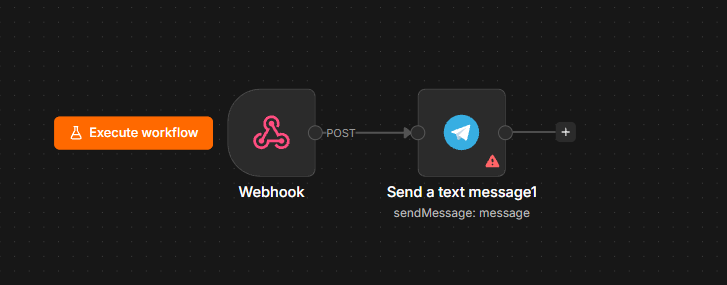

# 📩 Webhook to Telegram Notification

A lightweight n8n workflow that receives HTTP POST requests through a webhook and instantly forwards the received data as a formatted message to a Telegram chat.

This workflow is useful for sending notifications from websites, applications, forms, or external APIs directly to Telegram.

---

## ✨ Features

- 🌐 Receives HTTP POST requests via a Webhook
- 📨 Extracts request payload automatically
- 📲 Sends formatted messages to Telegram
- ⚡ Simple and easy to integrate with any application
- 🔄 Real-time notifications

---
---

## 🖼️ Workflow Architecture

<p align="center">
  
</p>

> **Note:** This diagram illustrates the complete n8n workflow used to process shopping requests and return the top product deals.

---
## 🏗️ Workflow Overview

```text
HTTP POST Request
        │
        ▼
     Webhook
        │
        ▼
Format Message
        │
        ▼
Send Telegram Message
```

---

## 🛠 Technologies Used

- n8n
- Webhook Node
- Telegram Bot API

---

## 📥 Input

Send a POST request to the webhook.

Example Request

```json
{
    "name": "John",
    "last_name": "Doe",
    "test": "Hello from n8n!"
}
```

---

## 📤 Output

Telegram receives:

```text
Name : John
Last Name : Doe
Message : Hello from n8n!
```

---

## 🔑 Required Credentials

| Service | Required |
|----------|----------|
| Telegram Bot | ✅ |

---

## 📦 Installation

1. Clone this repository.

```bash
git clone https://github.com/<your-username>/n8n-workflows.git
```

2. Open **n8n**.

3. Navigate to:

```
webhook-telegram-notification/
```

4. Import:

```
webhook-telegram-notification.json
```

5. Configure:
   - Telegram Bot Credentials
   - Telegram Chat ID

6. Activate the workflow.

---

## ⚙️ Workflow Logic

1. A client sends an HTTP POST request to the webhook.
2. The workflow extracts:
   - `name`
   - `last_name`
   - `test`
3. The data is formatted into a readable message.
4. The formatted message is sent to the configured Telegram chat.

---

## 📂 Project Structure

```text
webhook-telegram-notification/
├── README.md
├── webhook-telegram-notification.json
├── architecture.png
└── .env.example
```

---

## 🚀 Example Use Cases

- Website contact forms
- Application alerts
- Server notifications
- IoT device messages
- CI/CD deployment notifications
- CRM event notifications
- Custom API integrations

---

## 📄 License

This project is licensed under the MIT License.

---

## ⭐ Support

If you found this workflow useful, consider giving this repository a ⭐ on GitHub.
